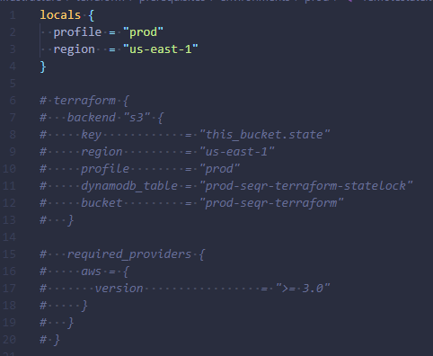
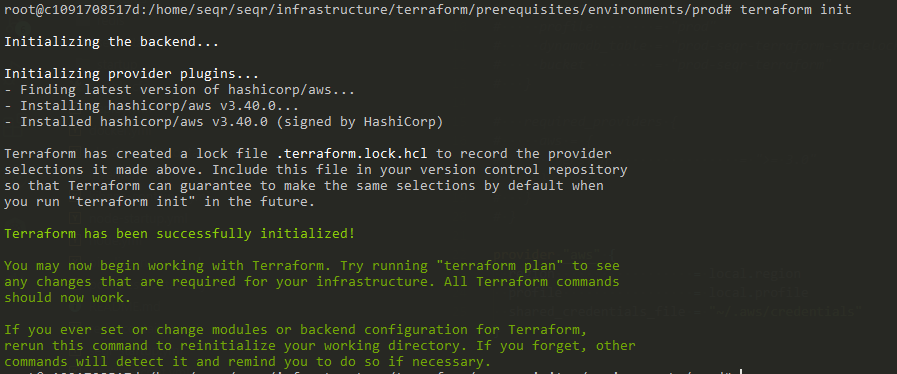
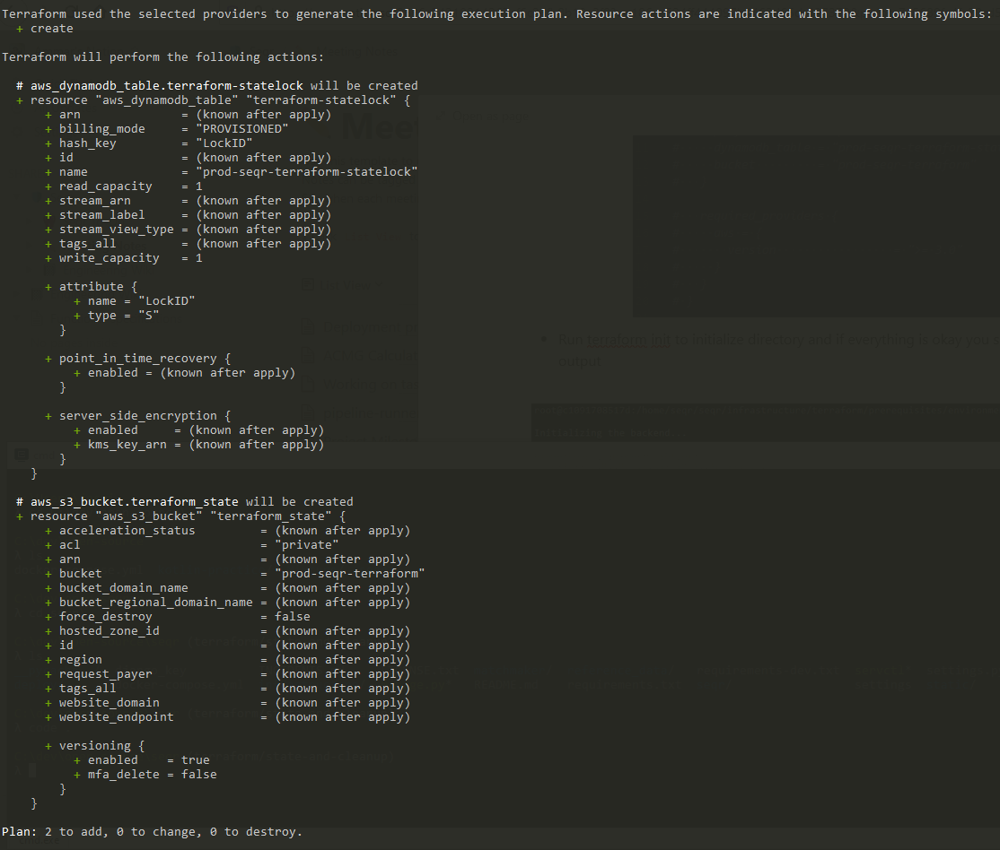
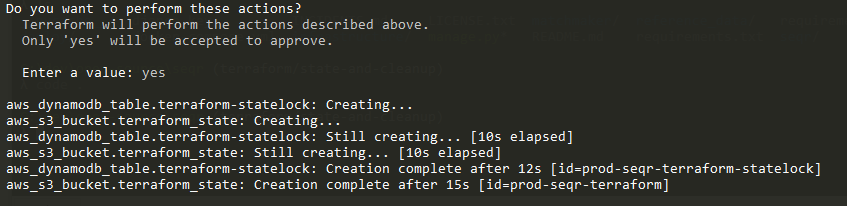
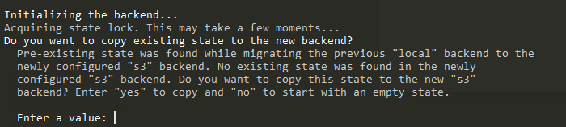
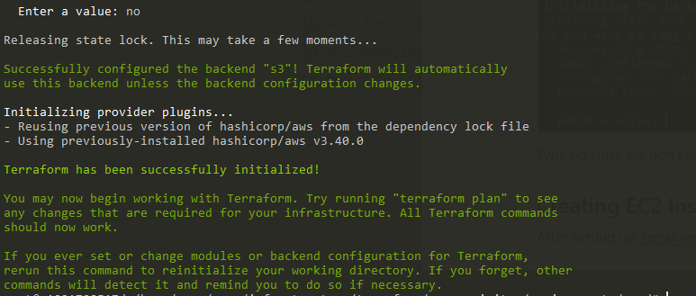
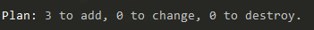

# Creating Infrastructure - AWS

## Tutorial

If you are not familiar with the Terraform, you can go over [Terraform Course](https://www.youtube.com/watch?v=SLB_c_ayRMo) from [https://www.freecodecamp.org/](FCC) as introduction.

Prerequisites:

1. Install Terraform https://www.terraform.io/downloads.html 
2. From the security credentials on AWS create an access key and store it in the ~/.aws/credentials file with the following format:

```
[dev]
aws_access_key_id = 
aws_secret_access_key = 
regions = us-east-1

[prod]
aws_access_key_id = 
aws_secret_access_key = 
regions = us-east-1
```

**Note:** dev and prod will have same credentials

After installing Terraform and creating credentials file it is time to create infrastructure on AWS. 

## Terraform state management

- Navigate into infrastructure/terraform/prerequisites/prod directory
- Open remotestate.tf file and comment terraform block section


- Run terraform init to initialize directory and if everything is okay you should see the following output


- After that, you have to run terraform apply where you will see the following output


- You will be prompted to type yes so that program can continue. It will create an S3 bucket in order to manage remote vs local state and a DynamoDB table that has configuration set to only 1 read and 1 write = only one person can manage remote state at a time


- Once apply finishes, remove commented terraform block, initialize terraform with terraform init. You will be prompted with the following message



Type no since we don't have any state yet.



Now you are ready to manage infrastructure with the remote state using Terraform.

## Creating EC2 Instance

After setting up Terraform state it is time to create infrastructure for seqr.

- Navigate infrastructure/terraform/environments/prod
- Run terraform init to get new state
- Run terraform apply to apply changes to the AWS where EC2 instance with the configuration that is defined in the seqr.resoruce.tf file = EC2 Instance (m5.2xlarge), root volume with 1TB (change if you need more), security groups for allowing access from the outside of AWS and a public IP address to the instance
- After apply gets to the prompt it should show only 3 resources that are going to be created



As before, type yes and wait until resources are provisioned on AWS.
